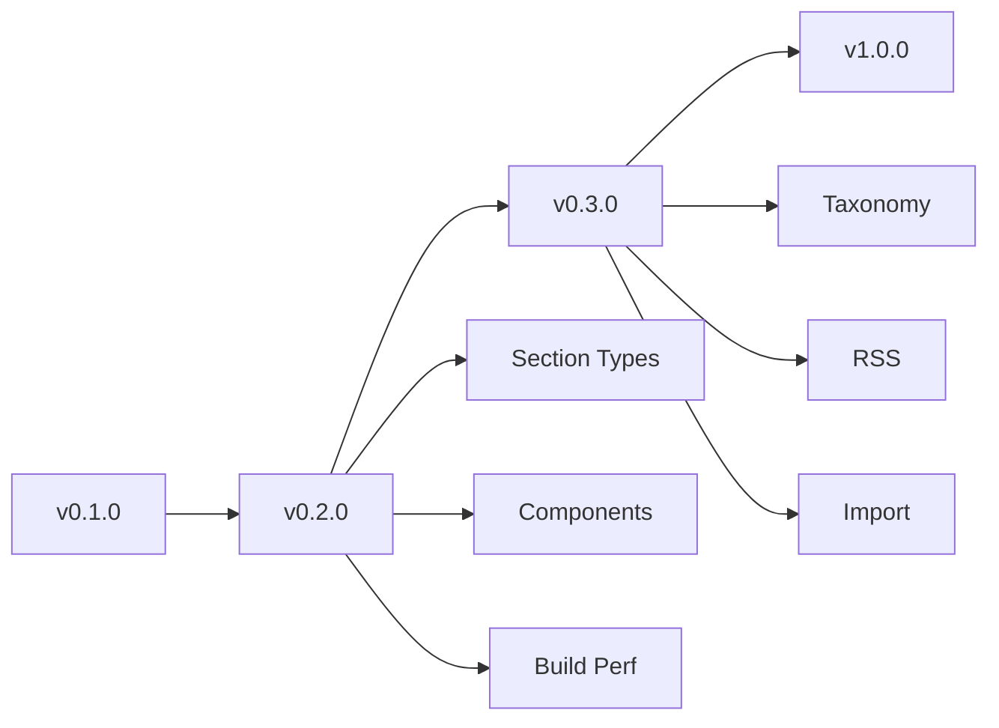

# lyt Execution Plan

## Version Overview

| Version | Focus | Status |
|---------|-------|--------|
| v0.1.0 | MVP - Core engine, build, serve | ✅ Complete |
| v0.2.0 | Composable content + rendering quality | 🔄 Near Release |
| v0.2.x | Documentation polish | 🔄 In Progress |
| v0.3.0 | Content organization + feeds | 📋 Planned |
| v1.0.0 | Stable, feature-complete | 📋 Planned |

---

## v0.1.0 — MVP (Complete)

**Scope**: Core engine, basic build/serve

- [x] YAML content parsing (pages, blog posts)
- [x] Markdown rendering (goldmark, GFM)
- [x] HTML template rendering
- [x] Design tokens → CSS custom properties
- [x] Dev server with hot reload
- [x] Static asset copying
- [x] Sitemap generation
- [x] Blog index page

**What's working**: `lyt build`, `lyt serve`, basic sections, cards, buttons

---

## v0.2.0 — Composable Content + Rendering Quality

**Goal**: Martin can define rich content components in YAML with consistent, beautiful rendering.

**Target**: Q2 2026

### Phase 1: Section Type Rendering (Week 1)

Implement proper rendering for all section types defined in YAML.

| Section Type | Current | Target |
|--------------|---------|--------|
| `hero` | Generic section | Full hero with title, subtitle, CTA buttons |
| `features` | Generic section | Grid of feature cards |
| `default` | Generic section | Standard content section |
| `callout` | ❌ Not rendered | Styled callout box |

**PR**: [TBD] Section type rendering

### Phase 2: Composable Components (Week 2-3)

Implement the component system from ADR-004.

| Component | YAML Type | Description |
|-----------|-----------|-------------|
| Pull-quote | `pull-quote` | Blockquote with attribution |
| Citation | `citation` | Book/article reference with link |
| CTA | `cta` | Call-to-action with button |
| Warning | `warning` | Styled alert box |
| Callout | `callout` | Styled info box |

**Implementation**:
1. Add component types to `render.go`
2. Add CSS classes to `base.css`
3. Document in schema

**PRs**:
- [TBD] Add pull-quote and citation components
- [TBD] Add CTA and warning components

### Phase 3: Build Performance (Week 4)

Address ADR-006 for faster iteration.

| Metric | Current | Target |
|--------|---------|--------|
| Full build (6 pages) | ~500ms | <200ms |
| Incremental rebuild | N/A | <100ms |

**Implementation**:
1. Add file modification tracking
2. Cache parsed YAML content
3. Parallelize page rendering

**PR**: [TBD] Fast incremental builds

### v0.2.0 Release Checklist

- [x] Hero section renders with subtitle and buttons
- [x] Features section renders as card grid
- [x] Callout section renders with styling
- [x] Pull-quote component: `<blockquote>` with attribution
- [x] Citation component: formatted reference
- [x] CTA component: styled banner with button
- [x] Warning component: styled alert box
- [x] Build time <200ms for 10 pages
- [x] Incremental rebuild <100ms
- [x] All tests passing
- [ ] Documentation updated

---

## v0.2.x — Documentation Focus

**Goal**: Complete documentation with proper hierarchy and cross-references

### Agent-Specific Content

Generate parallel HTML pages at `/agents/*` paths for LLM agents visiting the site.

| Feature | Description |
|---------|-------------|
| Agent link | Human-facing page includes `<a href="/agents">Agents Read This First</a>` |
| Agent pages | Separate HTML at `/agents/{slug}` with stripped markup |
| Config option | `agent_section.enabled: true` in page frontmatter |
| Scope | Works for all pages (docs, blog posts) generated by lyt |

**Implementation Steps**:

1. [ ] Add `agent_section` config to content.Collection
   - [ ] Update `internal/content/collection.go` to parse agent_section from config
   - [ ] Add `AgentSectionEnabled()` method

2. [ ] Update render.go to generate parallel pages
   - [ ] Add `renderAgentPage()` function - simplified HTML, no nav/hero
   - [ ] Strip decorations: no nav, no hero, no footer
   - [ ] Keep: title, sections, code blocks, tables

3. [ ] Update build.go to write agent pages
   - [ ] In page render loop, check if agent section enabled
   - [ ] Write parallel HTML to `/agents/{slug}/index.html`

4. [ ] Add agent link to human-facing pages
   - [ ] Update PageTemplate to include agent link in footer or below content
   - [ ] CSS: make it subtle but discoverable

5. [ ] Document feature
   - [ ] Add section to `/docs/configuration.yaml`
   - [ ] Example: `agent_section: { enabled: true, path: /agents }`

6. [ ] Verify
   - [ ] Build site, check `/agents/` paths exist
   - [ ] Verify content is stripped of decorations
   - [ ] Verify human page has agent link

---

**Original Documentation Focus**

### Step 1: Restructure `/docs` as Hub

Convert `/docs` from content-heavy to navigation hub:
- Brief intro (1-2 paragraphs)
- Section headings with 1-2 sentence summaries
- Links to child pages (NOT inline examples)
- [ ] Rewrite `content/pages/docs.yaml`

### Step 2: Create Child Documentation Pages

Each child page is complete, standalone reference:

| Page | Purpose | Status |
|------|---------|--------|
| `/docs/getting-started` | Install, new project, first build | 📋 Planned |
| `/docs/content` | YAML syntax, frontmatter, sections | 📋 Planned |
| `/docs/components` | All components with code examples | 📋 Planned |
| `/docs/configuration` | Site config, design tokens | 📋 Planned |
| `/docs/deployment` | All hosting options | 📋 Planned |

### Step 3: Update Component Gallery

`/components` becomes visual reference:
- Rendered examples (what it looks like)
- YAML code blocks (how to use it)
- Cross-link to `/docs/components` for full reference
- [ ] Rewrite `content/pages/components.yaml`

### Step 4: Cross-Reference Check

Ensure all pages link to each other:
- `/docs` → links to all children
- `/docs/getting-started` → links to `/docs/content`, `/docs/deployment`
- `/docs/content` → links to `/docs/components`
- `/docs/components` → links to `/docs/content`
- `/components` → links to `/docs/components`

### Execution Order

1. [x] Rewrite `/docs` as hub (keep it lean, links only)
2. [x] Create `/docs/getting-started` (foundation)
3. [x] Create `/docs/content` (core concept)
4. [x] Rewrite `/docs/components` as full reference with code
5. [x] Update `/components` as visual gallery + code
6. [x] Create `/docs/configuration`
7. [x] Create `/docs/deployment`
8. [ ] Verify all cross-links work

### Completion Criteria

- [x] `/docs` has headings, 1-2 sentence summaries, links to children
- [x] Each child page is complete and standalone
- [x] `/components` shows visual examples + code blocks
- [x] Every page links to related pages
- [ ] No broken links (needs testing)

---

## v0.3.0 — Content Organization + Feeds

**Goal**: Better content discoverability and syndication

### Phase 1: Taxonomy Pages (Week 1)

| Feature | Description |
|---------|-------------|
| Tag pages | `/tags/{tag}/index.html` listing posts |
| Category pages | `/category/{category}/index.html` |
| Blog archive | Paginated list of all posts |

**PR**: [TBD] Taxonomy pages

### Phase 2: RSS Feed (Week 2)

| Feature | Description |
|---------|-------------|
| Atom feed | `/blog/feed.xml` or `/feed.xml` |
| RSS for tags | `/tags/{tag}/feed.xml` |

**PR**: [TBD] RSS/Atom feeds

### Phase 3: Content Import (Week 3-4)

| Feature | Description |
|---------|-------------|
| Hugo import | `lyt import --from hugo ./content` |
| Jekyll import | `lyt import --from jekyll ./content` |
| Frontmatter conversion | YAML frontmatter → lyt YAML format |

**PR**: [TBD] Content importers

### v0.3.0 Release Checklist

- [ ] Tag pages generated automatically
- [ ] Category pages generated
- [ ] RSS/Atom feed available
- [ ] Import from Hugo works
- [ ] Import from Jekyll works

---

## v1.0.0 — Stable Release

**Goal**: Production-ready, well-documented, stable API

### Requirements

- [ ] Complete documentation (README, guides, examples)
- [ ] API stability (no breaking changes to YAML schema)
- [ ] Comprehensive test coverage (>80%)
- [ ] Performance verified at scale (500+ pages)
- [ ] CI/CD fully operational
- [ ] Release process documented

### Future Considerations (Post-v1)

- Plugin system for custom components
- Theme support
- Image optimization
- Search functionality
- Comments system (static, e.g., Giscus)
- Newsletter integration

---

## Progress Tracking

| Milestone | Start | Target | Status |
|-----------|-------|--------|--------|
| v0.1.0 MVP | - | - | ✅ |
| v0.2.0 Phase 1 | - | Week 1 | 🔄 |
| v0.2.0 Phase 2 | - | Week 2-3 | ⏳ |
| v0.2.0 Phase 3 | - | Week 4 | ⏳ |
| v0.2.0 Release | - | Q2 2026 | ⏳ |
| v0.3.0 | - | Q3 2026 | ⏳ |
| v1.0.0 | - | Q4 2026 | ⏳ |

---

## Dependencies

